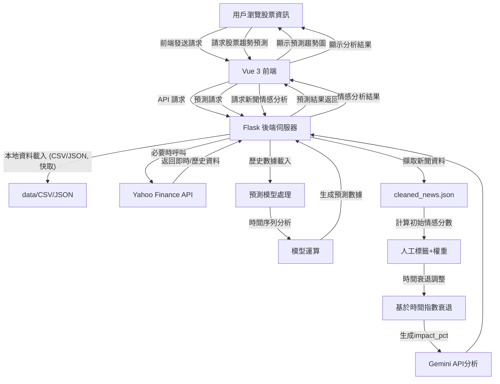

# 股票市場分析與預測平台

## 專案介紹

本專案是一個綜合性的股票市場分析與預測平台，旨在提供用戶全面的股票資訊、市場趨勢分析和基於AI的投資建議。系統支援台灣和美國股票市場的數據查詢，提供即時K線圖顯示、新聞情感分析和智能預測功能。

## 系統架構

### 前端架構

- **框架**: Vue 3 (使用組合式API)
- **UI元件庫**: Element Plus
- **狀態管理**: Pinia
- **圖表庫**: ECharts
- **HTTP請求**: Axios

### 後端架構

- **伺服器**: Flask (Python)
- **數據處理**: Pandas
- **AI分析**: Google Gemini API
- **跨域支援**: Flask-CORS

## 核心功能

### 1. 股票資訊一覽

- 分頁顯示台灣與美國股票列表
- 快速搜尋功能，支援名稱與代碼查詢
- 市場指數即時監控與趨勢顯示

### 2. 股票詳細資訊

- 個股K線圖與交易量分析
- 歷史價格查詢與圖表展示
- 公司基本資訊與財務概況

### 3. 新聞情感分析

- 相關新聞即時收集與展示
- AI驅動的新聞情感分析
  - 基於人工標籤初步分類
  - 考量情感詞強度權重
  - 時間衰退機制自動調整影響力
- 投資風險與機會評估

### 4. 股價趨勢預測

- 基於歷史數據的趨勢預測模型
- 多種時間範圍的預測結果
- 視覺化預測圖表

## 資料流程



## 安裝說明

### 系統需求

- Node.js v16+
- Python 3.9+
- 網際網路連接 (獲取股票資料與AI分析)

### 前端設置

```bash
# 進入前端目錄
cd frontend

# 安裝依賴
npm install

# 啟動開發伺服器
npm run dev

# 構建生產版本
npm run build
```

### 後端設置

```bash
# 進入後端目錄
cd server

# 建立虛擬環境
python -m venv venv

# 啟動虛擬環境
# Windows
venv\Scripts\activate
# macOS/Linux
source venv/bin/activate

# 安裝依賴
pip install -r requirements.txt

# 配置環境變數
cp .env.example .env
# 編輯.env文件，添加必要的API密鑰

# 啟動伺服器
python app.py
```

## API文檔

### 股票資訊相關

| 端點 | 方法 | 描述 | 參數 |
|------|------|------|------|
| `/api/companies` | GET | 獲取股票列表 | `market`, `page`, `pageSize` |
| `/api/stocks/:symbol` | GET | 獲取特定股票的價格歷史 | `symbol` |
| `/api/search-stocks` | GET | 搜尋股票 | `query`, `market` |

### 新聞與分析相關

| 端點 | 方法 | 描述 | 參數 |
|------|------|------|------|
| `/api/news/:company` | GET | 獲取公司相關新聞 | `company` |
| `/api/analyze/sentiment` | POST | 進行新聞情感分析 | `company`, `news` |

### 預測相關

| 端點 | 方法 | 描述 | 參數 |
|------|------|------|------|
| `/api/predict/:symbol` | GET | 獲取股價預測 | `symbol`, `days` |

## 情感分析演算法

本系統採用三階段情感分析處理流程：

1. **基礎情感判斷**: 使用人工標籤模型初步分類新聞情感
2. **情感詞權重處理**: 考慮文本中情感詞的強度
3. **時間衰退機制**: 依照新聞時間與當前時間差距進行指數衰退調整
   - 以50作為中性值
   - 30天後情感影響降至初始值的±0.01
   - 正面新聞最終趨近於50.01，負面新聞趨近於49.99

## 環境變數配置

在 `.env` 文件中配置以下環境變數：

```
FLASK_APP=app.py
FLASK_ENV=development
FLASK_DEBUG=1
GEMINI_API_KEY=your_gemini_api_key_here
```

## 技術特點

- **前後端分離架構**: 提高開發效率與系統彈性
- **響應式設計**: 支援多種設備與屏幕尺寸
- **資料可視化**: 豐富的圖表與視覺效果
- **AI驅動決策**: 整合Google Gemini進行智能分析
- **優雅降級**: 當API失敗時自動使用模擬資料保證用戶體驗

## 未來計劃

1. **增強預測模型**: 整合多種機器學習算法提高預測準確度
2. **社群功能**: 添加用戶評論與討論功能
3. **個人投資組合**: 允許用戶創建並跟蹤個人投資組合
4. **更多市場支持**: 擴展到更多國際市場

## 授權協議

本專案為私有軟體，未經許可不得複製、分發或修改。版權所有 © 2025。
